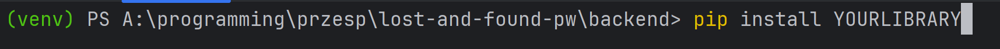
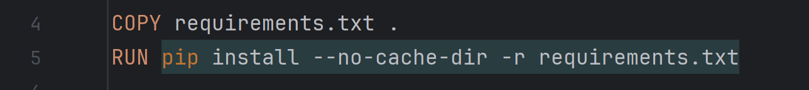

Twoja instrukcja jest już dość jasna, ale można ją jeszcze nieco poprawić pod kątem językowym i stylistycznym. Oto zaktualizowana wersja:

---

Cześć, oto krótka instrukcja.

Aby utworzyć środowisko wirtualne, proszę wpisać:
```
python -m venv venv
```

Aby uruchomić środowisko wirtualne w terminalu, proszę wpisać:
```
backend/venv/scripts/activate
```

Aby wyłączyć środowisko, wpisz:
```
deactivate
```

(Biblioteki, które będą Państwo instalować za pomocą pip, proszę instalować tylko w środowisku wirtualnym `venv`).


Jeśli chodzi o Dockerfile, jest to instrukcja do tworzenia obrazu Docker, używana w pliku `docker-compose.local.yml`. Można dokonywać zmian według własnych potrzeb, z wyjątkiem poniższego fragmentu:

Ten kod pobiera i instaluje wszystkie biblioteki z pliku `requirements.txt`. Aby utworzyć ten plik ze swoimi bibliotekami, proszę wpisać w terminalu:
```
pip freeze > requirements.txt
```
Proszę nie wysyłać środowiska do GitHub (dodałem odpowiednią regułę do `.gitignore`). Aby pobrać do swojego środowiska biblioteki zainstalowane przez innego członka zespołu, proszę użyć:
```
pip install -r requirements.txt
```

Dlatego przed każdym commitem proszę wykonać polecenie:
```
pip freeze > requirements.txt
```

Aby uruchomić cały projekt:
1. Uruchomić Docker Desktop.
2. W terminalu wpisać:
   ```
   docker-compose -f docker-compose.local.yml up --build
   ```
